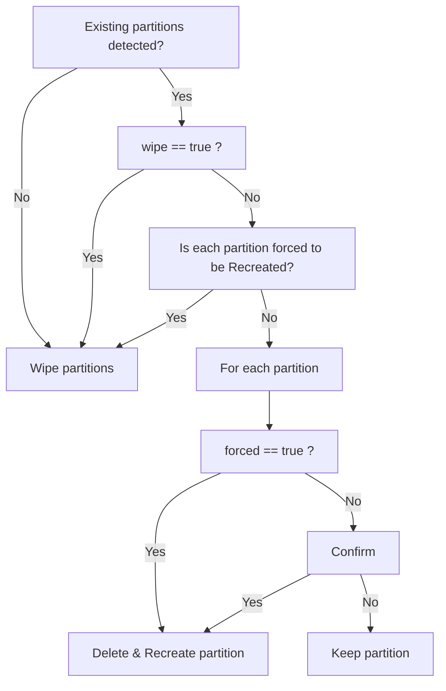

# Linux installer

## Create and format partition

```sh
storage --profile disks.yaml
```

### Description

This script brings a storage device into the state described by a YAML profile.
Based on the configuration, it can create, recreate, or preserve partitions,
configure encryption, create filesystems, assign labels, and mount partitions.

The script compares the current storage layout with the desired configuration
and performs the required operations to make the storage match the YAML profile.

The script detects whether the storage device is already partitioned. If existing
partitions are found, it requests user confirmation before wiping existing
filesystem signatures and partitions.

The script first checks whether existing partitions are present on the target
disk. If no partitions are found, all required partitions are created directly.

The `wipe` property forces disk cleanup. When `wipe: true` is specified, existing
filesystem signatures and partition data are removed without user confirmation.

Otherwise, each partition is evaluated individually. Partitions with `force: true`
are deleted and recreated, while all other partitions require user confirmation
before being deleted and recreated.



### YAML profile example

_**"disks.yaml"**_

```yaml
disks:
  - device: /dev/sda
    table: gpt
    wipe: false

    partitions:
      - name: EFI
        size: 512M
        type: EFI System
        filesystem: vfat
        label: EFI
        mount_point: /boot/efi
        force: true

      - name: root
        size: 50G
        type: Linux filesystem
        encryption:
          type: luks
          mapping: cryptroot
        filesystem: ext4
        label: ROOT
        mount_point: /
        force: true

      - name: home
        size: rest
        type: Linux filesystem
        encryption:
          type: luks
          mapping: crypthome
        filesystem: ext4
        label: HOME
        mount_point: /home
```

### YAML field reference

The input YAML describes one or more disks and the partitions that must exist on
each disk.

|         Field | Description                                                                                                                                                                                                      |
| ------------: | ---------------------------------------------------------------------------------------------------------------------------------------------------------------------------------------------------------------- |
|      `device` | Path to the block device to be partitioned, for example `/dev/sda`.                                                                                                                                              |
|       `table` | Partition table type to create or expect on the disk. Supported values are `gpt` and `mbr`.                                                                                                                      |
|        `wipe` | If `true`, existing filesystem signatures and partition data on the disk may be removed before creating the requested layout. If `false` or omitted, the installer asks for permission before wipe.              |
|  `partitions` | Ordered list of partitions to create, reuse, encrypt, format, and mount. The order matters because fixed-size partitions are allocated first and a partition with size `rest` receives the remaining free space. |
|        `name` | Human-readable partition name. It can also be used to identify an existing partition when `keep` is `true`.                                                                                                      |
|        `size` | Requested partition size, for example `512M` or `50G`. The special value `rest` means the partition should use all remaining free space on the disk.                                                             |
|        `type` | Partition type or role to assign in the partition table, for example `EFI System` or `Linux filesystem`.                                                                                                         |
|  `encryption` | Optional encryption settings. If present, the partition is treated as an encrypted container before formatting and mounting.                                                                                     |
|        `type` | Encryption technology to use. In this YAML structure, `luks` means the partition should be initialized or opened as a LUKS container.                                                                            |
|     `mapping` | Name of the mapped decrypted device under `/dev/mapper`. For example, `cryptroot` produces `/dev/mapper/cryptroot`.                                                                                              |
|  `filesystem` | Filesystem type to create on the partition or on its decrypted mapping, for example `vfat` or `ext4`.                                                                                                            |
|       `label` | Filesystem label to assign during formatting.                                                                                                                                                                    |
|       `force` | If `true`, an existing matching partition may be deleted and recreated without asking for confirmation. Use this when the partition can be destructively rebuilt to match the profile.                           |
| `mount_point` | Target mount path inside the installed system, for example `/`, `/home`, or `/boot/efi`.                                                                                                                         |
